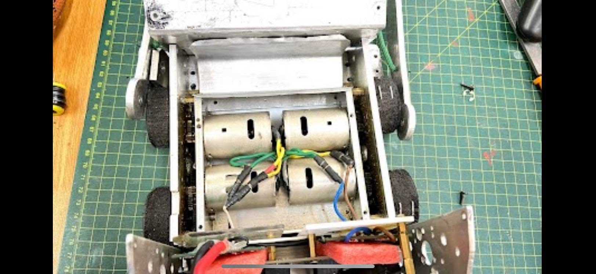
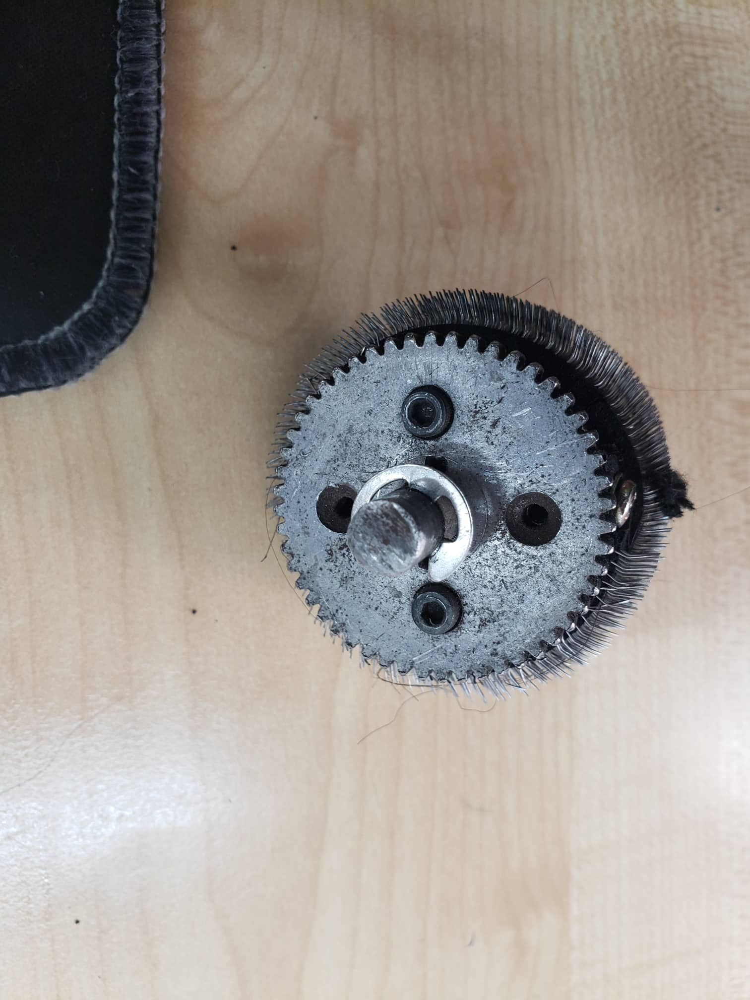
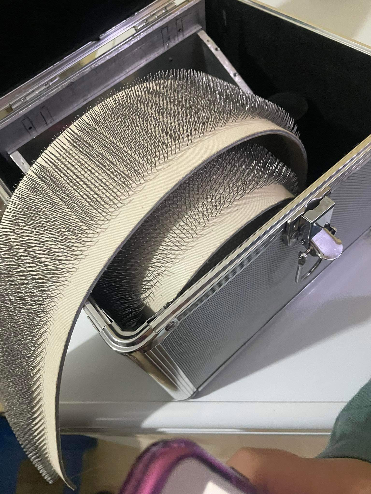
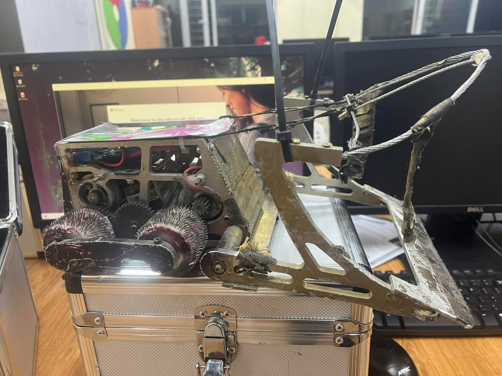
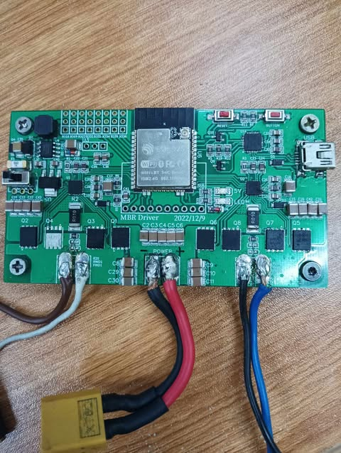
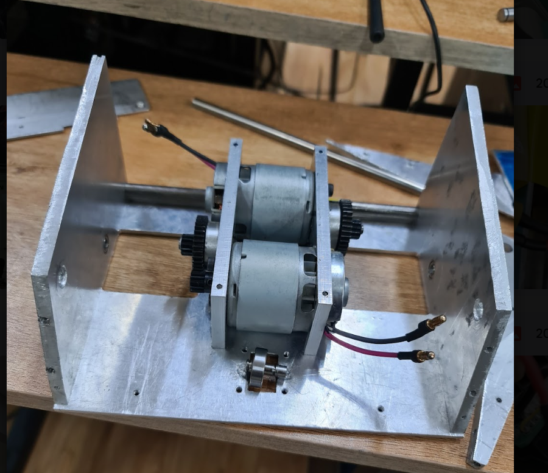

# 3 kg Contact Impact Football Robot

A competitive 3 kg contact robot built for 5v5 robofootball matches. This project combined mechanical fabrication, drivetrain design, battery wiring, testing, and iterative troubleshooting under competition constraints.

## Project Overview

The robot was designed around a compact aluminum chassis with a geared drivetrain and a mechanical trapping arm. My work focused mainly on the physical build, drivetrain, power delivery, fabrication, and testing.

## What I Worked On

- Fabricated the robot body from aluminum sheet metal using cutting, drilling, and hand tools.
- Built and installed the mechanical trapping arm and outer structure.
- Worked with a 12-tooth to 51-tooth spur gear drivetrain.
- Constructed and custom-soldered 12 V LiPo battery packs with heavy-gauge wiring.
- Supported dual 24 V, 7500 RPM drive motors and worked through power-delivery issues during testing.
- Performed operational drive testing and troubleshooting before and during competition use.
- Helped maintain and repair the mechanical system after high-impact contact.

## Engineering Challenges

### Original Drivetrain and Reliability Observations

The original robot used a **12-tooth motor pinion** driving a **51-tooth gear** attached to the wheel shaft. Its gear reduction was:

```text
Gear ratio = driven teeth / driving teeth = 51 / 12 = 4.25:1
```

In the ideal case, the wheel shaft turns at about 23.5% of motor speed and produces 4.25 times the motor torque (before mechanical losses). This gave the robot useful pushing power, but the system became unreliable under repeated impacts.

**Observed during competition and repairs:**
- Spur gears wore down; teeth on the larger gear were damaged.
- The aluminum frame bent after hits, and alignment became less reliable.
- The robot sometimes drifted rather than driving straight, requiring manual correction.
- One drivetrain side sometimes developed more friction than the other.
- Bolt holes wore out, and repeated disassembly made maintenance difficult.

**Engineering interpretation:** Frame deformation, mounting-hole wear, damaged gear teeth, and misalignment could contribute to different rolling resistance on each side. These are possible causes, not isolated or experimentally proven root causes. The main lesson was that motor power alone did not ensure reliability; alignment, frame stiffness, impact resistance, and serviceability also mattered.

### P, PD, and PID Tuning (Illustrative Code)

The following C++ example explores **possible feedback-based steering correction**. It is **not a claim that this code ran on the competition robot**. A heading sensor (such as an IMU) or encoder-based speed feedback is needed to measure error. Feedback cannot fix a mechanically damaged drivetrain.

- **P:** responds to present error; large gain can cause oscillation.
- **PD:** adds derivative action to damp rapid corrections.
- **PID:** adds integral action to reduce persistent offset, with a clamp to limit integral windup.

```cpp
#include <algorithm>

struct PIDController {
    float kp = 0.0f, ki = 0.0f, kd = 0.0f;
    float integral = 0.0f, previousError = 0.0f;
    float integralLimit = 100.0f;

    // error = target - measured value; dt is in seconds.
    float update(float error, float dt) {
        if (dt <= 0.0f) return 0.0f;
        integral = std::clamp(integral + error * dt,
                              -integralLimit, integralLimit);
        float derivative = (error - previousError) / dt;
        previousError = error;
        return kp * error + ki * integral + kd * derivative;
    }

    void reset() { integral = 0.0f; previousError = 0.0f; }
};

// P:   kp > 0; ki = 0; kd = 0
// PD:  kp > 0; ki = 0; kd > 0
// PID: kp > 0; ki > 0; kd > 0
//
// Steering example (signs depend on actual wiring):
// float correction = controller.update(targetHeading - heading, dt);
// float left  = std::clamp(baseSpeed - correction, -1.0f, 1.0f);
// float right = std::clamp(baseSpeed + correction, -1.0f, 1.0f);
```

**Suggested tuning order:** Start with P control and increase `kp` gradually. Add `kd` if response overshoots or oscillates. Only add `ki` for persistent steady-state error. Test on a mechanically sound robot; gains, sensor units, and command limits must be adapted to the real hardware.

### Power Delivery

The drive motors could draw high current during acceleration and near-stall conditions, so battery wiring and connections needed to handle peak loads reliably. This made soldering quality, wire sizing, and connection integrity important parts of the build.

### Structural Durability

The robot had to remain light enough for the competition weight class while surviving repeated contact. This required balancing strength, weight, ease of repair, and available materials.

## What I Learned

This project gave me practical experience with the relationship between mechanical design, electrical power delivery, and real-world reliability.

I learned that a design that works during static testing can behave very differently once vibration, impact, current spikes, and repeated use are introduced.

It also taught me the value of iterative testing: build, test, identify the weakest point, improve it, and repeat.

## Build Photos

### Robot / Assembly







### Additional Build Images







## Skills Used

Mechanical Fabrication · Robotics · Soldering · Power Distribution · LiPo Batteries · Drivetrain Assembly · Troubleshooting · SolidWorks · Hand Tools · Power Tools
